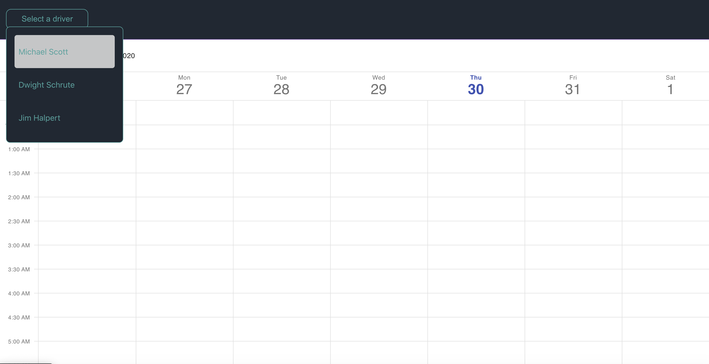
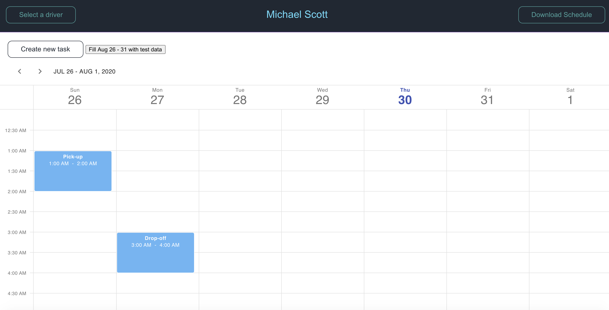
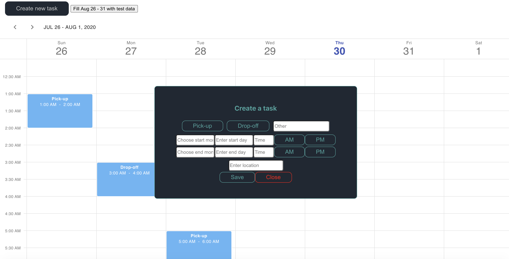
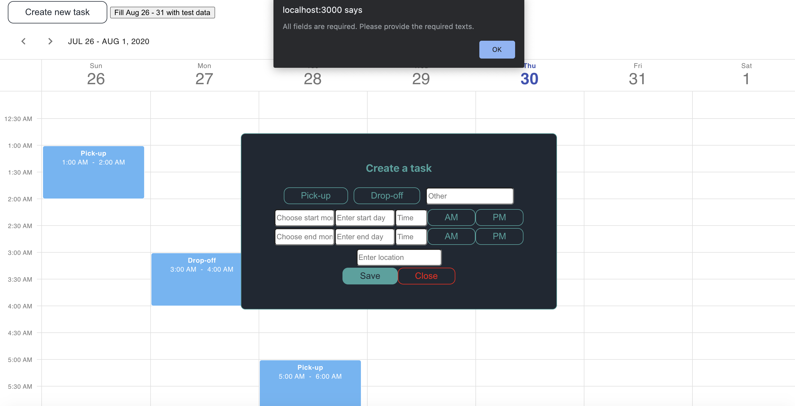
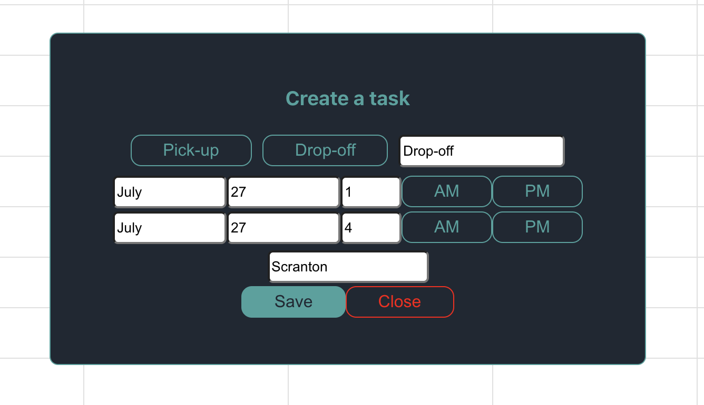
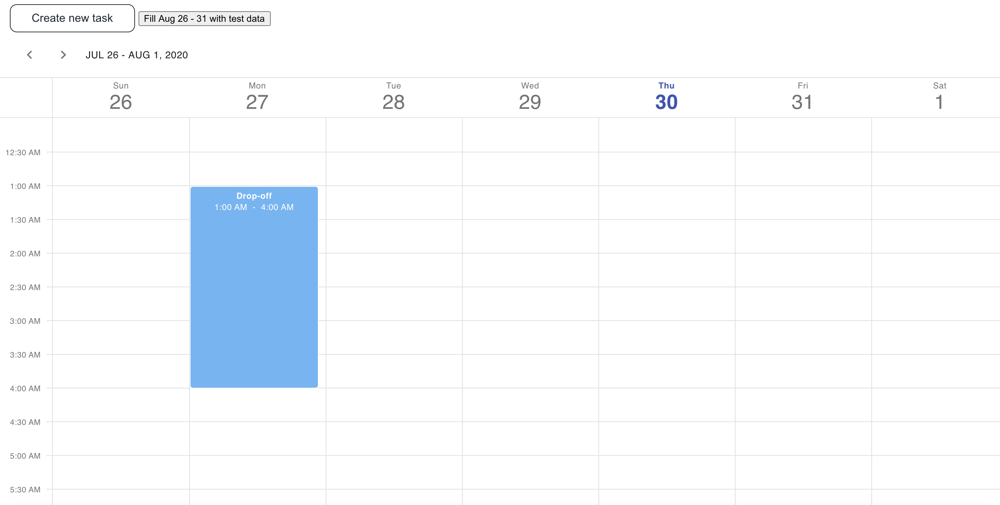
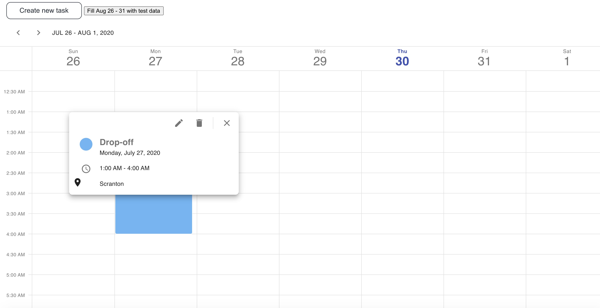
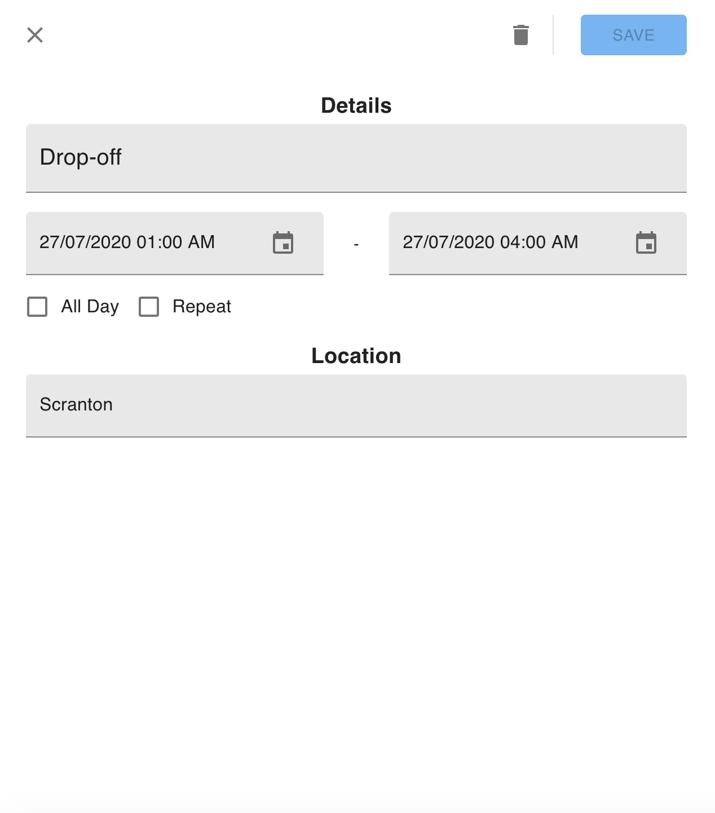
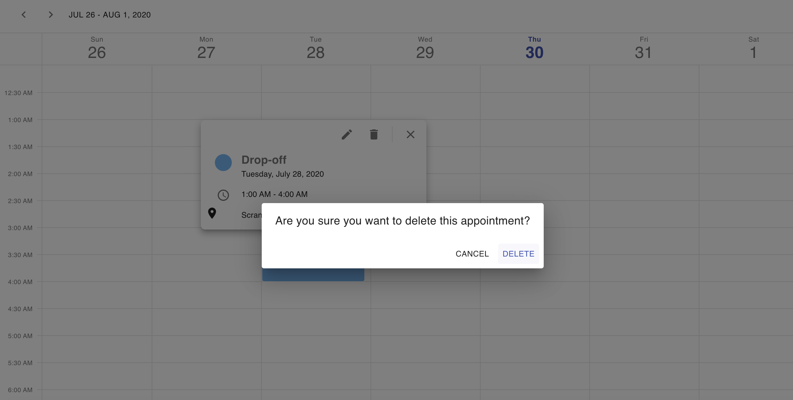
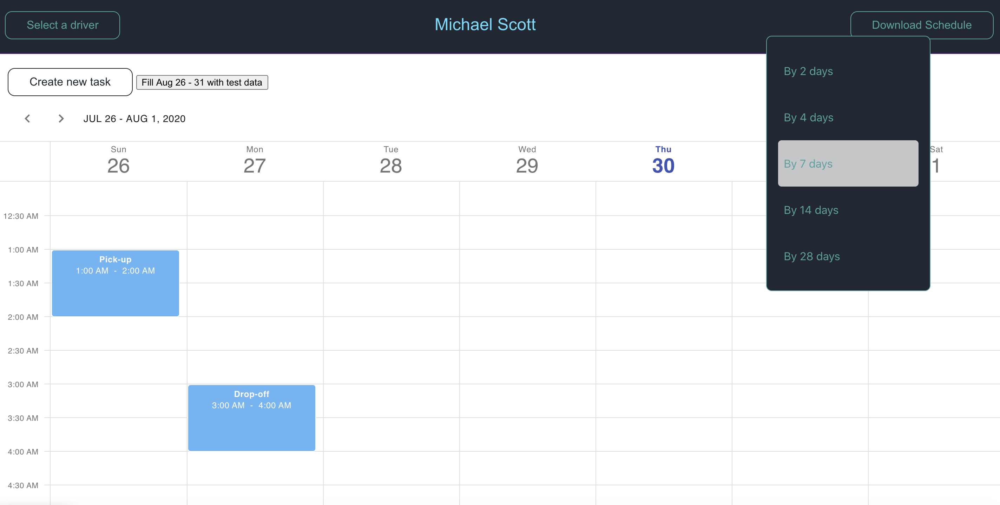

# Roserocket challenge - Dispatcher

clone this project and cd to it **/path/roserocket-challenge**

## __Run these on the root folder__
Install Dependencies with: **npm install** for server and **npm run client-install** for client

To run the project simply run **npm run dev**

# Dispatcher

Initial page of the app which only shows an empty calendar and a drop down where you can choose a drivers schedule

Once a driver is chosen then it goes to this page:

From here, you can fill the schedule for selected driver through Aug 26 - 31.
Or you can just create your own!

Every field is required and should be valid, otherwise, the app will complain.

If everything works and good to go...

then the task will be added to the drivers calendar

User can also click on each task...

they can either edit 

or delete the chosen task

If the user wants to export the data into a CSV file, they can click on the __Download Schedule__ where they could choose the time frame from 2, 4, 7, 14 or 28 days counting all the task within the range

